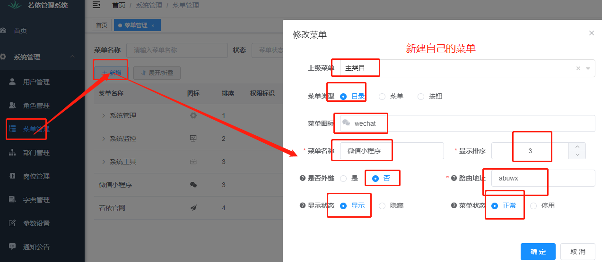

<p align="center">
	
</p>
<h1 align="center" style="margin: 30px 0 30px; font-weight: bold;">基于RuoYi-Vue和Uniapp的小程序脚手架</h1>
<h4 align="center">本应用只是基于UniApp的微信小程序+后端脚手架，开箱即用</h4>

## 平台简介
一直想做一款基于若依后台管理系统的微信小程序，最近比较闲了，所以想做个简单的东西。主要为了学习，走一遍整个过程，也是为像我这种小白提供些简单的学习内容。 这是一套前后端一起的脚手架，省去了好多需要写的东西，开箱即用
若依是一套全部开源的快速开发平台，毫无保留给个人及企业免费使用。

## 前后端不分离版后台 
1. 源码地址：https://gitee.com/rahman/abu-coder-ruoyi-uniapp-wx
2. 后端演示：https://abucoder.rasmall.cn/login
3. 微信小程序体验

- 开源不易，喜欢的给个Star，请开源者喝杯咖啡吧

## 相关技术
* 前端采用Vue、Element UI。
* 后端采用Spring Boot、Spring Security、Redis & Jwt。
* 微信小程序:Uview+ColorUi+前段铺子

## 内置功能

1. 微信小程序用户：微信用户基本信息
2. 轮播图管理：微信小程序端的轮播图管理
3. 开源项目推荐：微信小程序端的列表内容
4. 用户管理：用户是系统操作者，该功能主要完成系统用户配置。
5. 部门管理：配置系统组织机构（公司、部门、小组），树结构展现支持数据权限。
6. 岗位管理：配置系统用户所属担任职务。
7. 菜单管理：配置系统菜单，操作权限，按钮权限标识等。
8. 角色管理：角色菜单权限分配、设置角色按机构进行数据范围权限划分。
9. 字典管理：对系统中经常使用的一些较为固定的数据进行维护。
10. 参数管理：对系统动态配置常用参数。
11. 通知公告：系统通知公告信息发布维护。
12. 操作日志：系统正常操作日志记录和查询；系统异常信息日志记录和查询。
13. 登录日志：系统登录日志记录查询包含登录异常。
14. 在线用户：当前系统中活跃用户状态监控。
15. 定时任务：在线（添加、修改、删除)任务调度包含执行结果日志。
16. 代码生成：前后端代码的生成（java、html、xml、sql）支持CRUD下载 。
17. 系统接口：根据业务代码自动生成相关的api接口文档。
18. 服务监控：监视当前系统CPU、内存、磁盘、堆栈等相关信息。
19. 缓存监控：对系统的缓存信息查询，命令统计等。
20. 在线构建器：拖动表单元素生成相应的HTML代码。
21. 连接池监视：监视当前系统数据库连接池状态，可进行分析SQL找出系统性能瓶颈。

## 本休昂木在线体验
- 体验地址：https://ga.rasmall.cn/
- testadmin/admin123  
- 陆陆续续收到一些打赏，为了更好的体验已用于演示服务器升级。谢谢各位小伙伴。

## 教程
### 新建表

### 下载若依源代码

### 新建数据库并导入所需数据表

### 新建自己的模块


### 自己摸快的Pom文件配置

### ruoyi根目录下的Pom文件配置

### ruoyi-admin目录下的pom文件配置

### 启动前后端代码


### 新建自己的菜单

### 开始生成代码


### 开始导入相关代码
#### 数据库文件导入


### 开始复制生成的代码到相应的位置


## 提示
* pom.xml文件变灰(出现删除线)
* 选择file-settings-Build-Build Tools-igored Files 取消勾选变灰的文件即可
* 不要忘了手动加载下自己模块的pom文件依赖，手动加载即可


### 测试
* 前后端重新启动下，打开我们新建的菜单就能看到了
* 到此我们已经完成了自己业务的建立，是不是很简单啊，记得点赞哈~


### 微信小程序端接口编写
1. 新建Api包

2. Api路径放行（不放行，小程序端访问不到）

3. 编写测试接口，并测试

4. 开始编写正式接口
* 此时我们要依赖hutool工具，在ruoyi-common模块的Pom文件加入依赖


```xml
<!--hutool工具类-->
<dependency>
    <groupId>cn.hutool</groupId>
    <artifactId>hutool-all</artifactId>
    <version>5.8.0</version>
</dependency>
```
5. 登录接口（保存数据库及更新数据）
```java
package com.ruoyi.abuwxapi;

import cn.hutool.core.util.StrUtil;
import com.alibaba.fastjson2.JSON;
import com.alibaba.fastjson2.JSONObject;
import com.ruoyi.abuwx.domain.AbucoderWxuser;
import com.ruoyi.abuwx.service.IAbucoderWxuserService;
import com.ruoyi.common.core.domain.AjaxResult;
import com.ruoyi.common.utils.DateUtils;
import com.ruoyi.common.utils.http.HttpUtils;
import com.ruoyi.common.utils.uuid.UUID;
import org.springframework.beans.factory.annotation.Autowired;
import org.springframework.web.bind.annotation.*;

import java.util.HashMap;
import java.util.Map;

@RestController
@RequestMapping("/wxapi/")
public class WxLoginController {

    /**
     * 测试接口
     * @return
     */
    @GetMapping("test")
    public AjaxResult test(){
        return AjaxResult.success("小程序api调试成功！~");
    }

    @Autowired
    private IAbucoderWxuserService iAbucoderWxuserService;

    /**
     * 你自己的微信小程序APPID
     */

    private final static String AppID = "你自己的appid";
    /**
     * 你自己的微信APP密钥
     */
    private final static String AppSecret = "你自己的密钥";

    /**
     * 登录时获取的 code（微信官方提供的临时凭证）
     * @param object
     * @return
     */
    @PostMapping("/wxlogin")
    public AjaxResult wxLogin(@RequestBody JSONObject object){
        //微信官方提供的微信小程序登录授权时使用的URL地址
        String url  = "https://api.weixin.qq.com/sns/jscode2session";
        System.out.println(object);
        /**
         * 拼接需要的参数
         * appid = AppID 你自己的微信小程序APPID
         * js_code = AppSecret 你自己的微信APP密钥
         * grant_type=authorization_code = code 微信官方提供的临时凭证
         */
        String params = StrUtil.format("appid={}&secret={}&js_code={}&grant_type=authorization_code", AppID, AppSecret, object.get("code"));
        //开始发起网络请求,若依管理系统自带网络请求工具，直接使用即可
        String res = HttpUtils.sendGet(url,params);
        System.out.println("输出请求到的结果");
        System.out.println(res);
        JSONObject jsonObject = JSON.parseObject(res);
        String session_key = (String) jsonObject.get("session_key");
        String openid = (String) jsonObject.get("openid");
        if (StrUtil.isEmpty(openid)) {
            return AjaxResult.error("未获取到openid");
        }
        String token = UUID.randomUUID().toString();
        Map<String, Object> data = new HashMap<>();
        data.put("token", token);
        data.put("session_key", session_key);
        data.put("openid", openid);
        data.put("state",true);
        data.put("nickName",object.get("nickName"));
        data.put("avatarUrl",object.get("avatarUrl"));
        /**先通过openid来查询是否存在*/
        AbucoderWxuser abucoderWxuser = iAbucoderWxuserService.selectAbucoderWxuserOpenID(openid);
        if (abucoderWxuser == null){
            /**如果不存在就插入到我们的数据库里*/
            AbucoderWxuser  wxuser = new AbucoderWxuser();
            wxuser.setNickname(String.valueOf(object.get("nickName")));
            wxuser.setGender((Integer) object.get("gender"));
            wxuser.setAvatar(String.valueOf(object.get("avatarUrl")));
            wxuser.setOpenid(openid);
            wxuser.setCreateTime(DateUtils.getNowDate());
            wxuser.setCreateBy("Abu");
            iAbucoderWxuserService.insertAbucoderWxuser(wxuser);
        }else {
            /**如果存在就更新数据库里原有的数据*/
            abucoderWxuser.setNickname(String.valueOf(object.get("nickName")));
            abucoderWxuser.setGender((Integer) object.get("gender"));
            abucoderWxuser.setAvatar(String.valueOf(object.get("avatarUrl")));
            abucoderWxuser.setUpdateTime(DateUtils.getNowDate());
            abucoderWxuser.setUpdateBy("Abu");
            iAbucoderWxuserService.updateAbucoderWxuser(abucoderWxuser);
        }
        /**返回结果集到前段*/
        return AjaxResult.success(data);
    }
}

```
6.小程序登录测试

## 其他说明
- 其他的接口原理基本都一样。地接看源码吧~
- 开源不易，喜欢的给个Star，请开源者喝杯咖啡吧